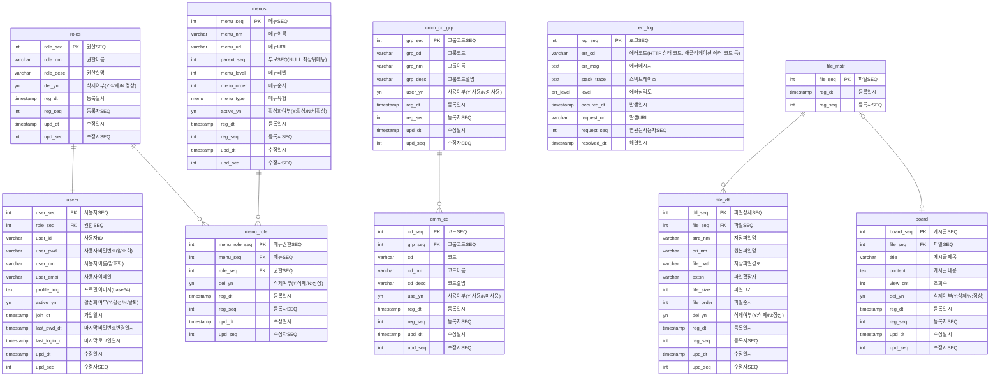

## 🗂️ DATABASE

 

### ⚡ ERD

 
 

## 🖇️ 프로젝트 문서
### 🗂️ DATABASE
### 📑 Create Table 👉 [바로가기](sql/create_table.sql)
### 📑 Create Sequence 👉 [바로가기](sql/create_sequence.sql)
### 📑 Create Enum 👉 [바로가기](sql/create_enum.sql)