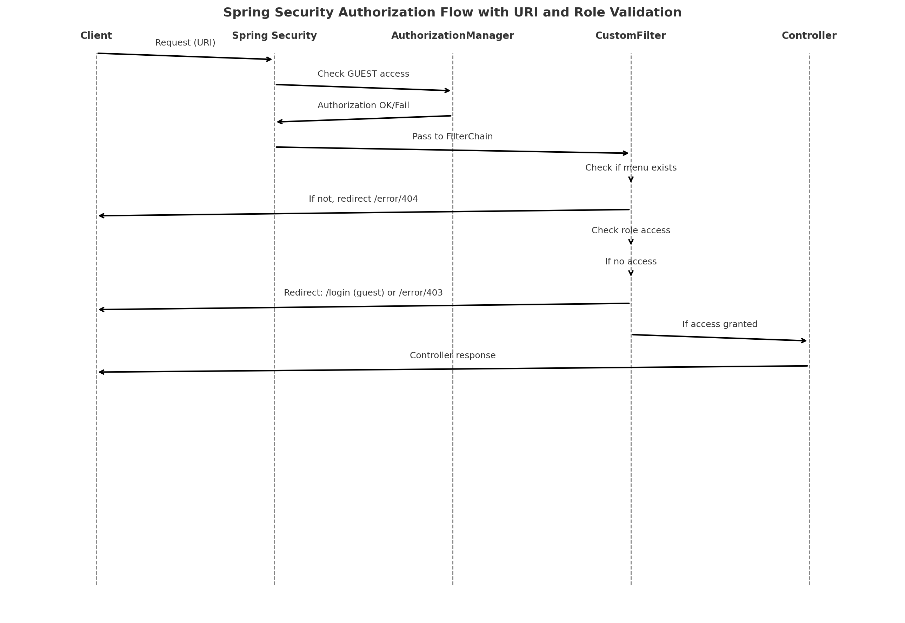

# 🔐 인증/인가 처리 구조
**Spring Security 기반의 인증/인가 구조**에 `menus`, `roles` 테이블을 결합하여, <br>
정적인 URL 설정이 아닌 **DB 기반의 동적 접근 제어**를 구현하였습니다.

<br>
<br>

## ⚡Security Authorization Flow


<br>

## 🧩 전체 구조 요약
- 로그인 이후 사용자 정보는 `UserSessionDTO`에 저장되어 세션을 통해 관리됩니다.
- 각 URL은 메뉴 정보(`menus`)와 권한 정보(`menu_roles`)에 따라 접근 여부를 판단합니다.
- GUEST 사용자는 `AuthorizationManager`와 URL 캐시를 통해 허용 여부가 판단됩니다.
- 모든 요청은 커스텀 필터에서 **메뉴 존재 여부 및 권한 검증**을 거친 후 통과됩니다.

<br>

## 🔐 인증(Authentication)

- Spring Security의 기본 인증 구조 사용 (`UsernamePasswordAuthenticationFilter`)
- 사용자 인증 정보는 `CustomUserDetailsService`를 통해 조회
- 인증 성공 시 세션에 `UserSessionDTO` 저장

```java
session.setAttribute(SESSION_KEY.FRONT, userSessionDTO);
```

<br>

## 🔐 인가(Authorization) 처리 흐름
### 1. `SecurityFilterChain` 설정
```java
http.addFilterBefore(menuAuthorizationFilter, UsernamePasswordAuthenticationFilter.class)
    .authorizeHttpRequests(auth -> auth
        .requestMatchers("/error/**", "/pagination").permitAll()
        .requestMatchers("/css/**", "/images/**", "/js/**").permitAll()

        // 모든 요청을 AuthorizationManager에게 위임
        .anyRequest().access(guestUrlAuthorizationManager)
    )
```

- 정적 자원 및 일부 공통 경로는 허용
- 그 외 모든 요청은 `GuestUrlAuthorizationManager`에서 1차 접근 허용 여부 판단
- 그 이후 `menuAuthorizationFilter`에서 메뉴 존재 여부 및 권한 검증 수행

<br>

### 2. `GuestUrlAuthorizationManager`
```java
@Override
public AuthorizationDecision check(...) {
    ...

    // GUEST 허용 URL && 비인증 사용자 → 접근 허용
    if (isGuest && isGuestUrl) {
        return new AuthorizationDecision(true);
    }

    // 인증된 사용자 → 무조건 허용
    if (auth.isAuthenticated() && !(auth instanceof AnonymousAuthenticationToken)) {
        return new AuthorizationDecision(true);
    }

    // 나머지는 차단
    return new AuthorizationDecision(false);
}
```

- GUEST 사용자(GUEST RoleSeq)의 접근 가능 URL 목록을 기준으로 허용 여부 판단
- URL 목록은 캐시로 관리되며, 접근 가능 여부를 실시간으로 검증

<br>

### 3. `MenuAuthorizationFilter`
```java
@Override
protected void doFilterInternal(...) {
    ...

    // 메뉴 존재 여부 확인
    if ( !menuService.isMenuExist(requestURI) ) {
        response.sendRedirect("/error/404");
        return;
    }

    // 권한 확인
    if ( !menuRoleService.hasAccess(roleSeq, requestURI, requestMethod) ) {
        if ( roleSeq == ROLE_KEY.GUEST) {
            response.sendRedirect(EXCLUDE_URL.LOGIN);
        } else {
            response.sendRedirect("/error/403");
        }
        return;
    }

    ..
}
```

- 모든 요청에 대해 다음 두 가지를 검증:
    1. 해당 URL이 등록된 메뉴인지 (`menus` 테이블 기준)
    2. 현재 사용자(`role`)가 해당 URL에 대한 접근 권한을 가지고 있는지

<br>

### 4. 접근 허용 URL 캐시 자동 갱신
```java
@Scheduled(fixedRate = 600000)
public void refreshPermitAllUrls() {
    menuRoleService.refreshGuestAccessibleUrls();
    globalControllerAdvice.evictGuestMenuCache();
}
```

- GUEST가 접근 가능한 URL 목록은 캐시되어 사용되며, `@Scheduled` 작업으로 주기적으로 갱신됩니다.

<br>

## 📌 보조 처리 기능 (권한 기반 정보 활용)
### 1. `GlobalControllerAdvice`
- View Controller의 렌더링 과정에서 `@ModelAttribute`를 통해 로그인 사용자 정보와 해당 권한의 메뉴 목록을 자동 주입
- 세션 정보를 기반으로 역할별 메뉴 캐시를 관리하여 불필요한 중복 조회 방지

<br>

### 2. `GlobalRestControllerAdvice`
- API 요청 시, DTO에 `@InitBinder`를 통해 세션에 저장된 사용자 정보를 자동 주입
- 인증이 완료된 사용자에 한해 `BaseDTO` 상속 객체에 세션 정보를 전달하여 보안성을 높이고, 별도의 컨트롤러 코드 작성 없이 통일된 인증 기반 처리 가능
